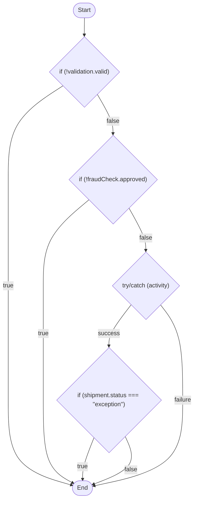
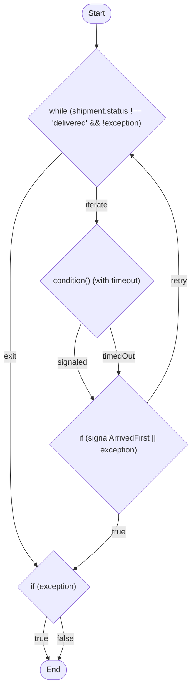
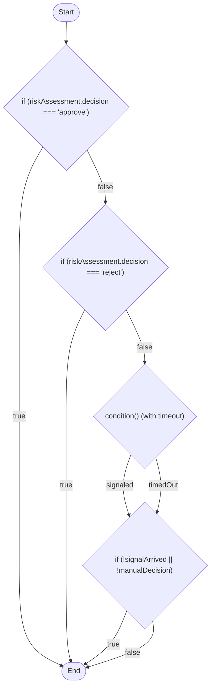
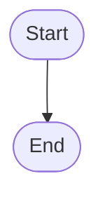

# PathKit pilot: ecommerce-fulfillment-temporal

Date: 2026-09-22

PathKit v0.8.0 (this checkout, built from source) was run end-to-end against a
complete, working, already-reviewed Temporal TypeScript sample project —
`ecommerce-fulfillment-temporal` at `/home/technoidentity-com/Documents/Temporal_Big_Project`
— to see how a real, non-synthetic 8-workflow project fares, not just
PathKit's own `demo/` fixtures.

## What was run

Built from source (`npm run build`), then invoked exactly as `CONTRIBUTING.md`
describes (`node bin/pathkit ...`, not `node dist/cli.js`), once per exported
workflow function, against every workflow file in the target project's
`src/workflows/`:

```bash
WF=/home/technoidentity-com/Documents/Temporal_Big_Project/src/workflows
for f in orderFulfillment orderCancellation shipping fraudCheck refund \
         paymentProcessing subscriptionRenewal inventoryReservation; do
  node bin/pathkit analyze "$WF/$f.workflow.ts" --mermaid
done
```

Also ran the combined, whole-directory command:

```bash
node bin/pathkit report "$WF" --traces /tmp/pathkit-empty-traces --no-color
```

(`--traces` is required by `report`; an empty directory was used since the
target project's own tests weren't wired up to PathKit's coverage-recording
helpers — that's out of scope for this pilot, which is about `analyze`/path
detection, not coverage.)

Every `analyze` invocation exited **0** with no stderr output. `report` also
exited 0, correctly discovering and analyzing all 8 workflow files (39 total
declared paths across the project) with no parse failures.

## Sample output

### `orderFulfillmentWorkflow` (the saga/compensation workflow — most complex control flow in the project)

```
Workflow: orderFulfillmentWorkflow
Total paths: 5


```

(HTML-entity-escaped apostrophes shown de-escaped above for readability; real
output has `&#39;`.)

Note what this output is **missing** relative to the real workflow's
behavior, documented as findings below: the saga's compensation stack
(`compensations.push(...)`, run LIFO in the `catch` block) never appears as a
node or edge anywhere in the graph, and the `if (shipment.status ===
'exception') { throw ... }` branch — which at runtime is caught by the very
`try`'s own `catch` and triggers compensation before re-throwing — is shown
going straight to `End`, bypassing the `catch` block entirely.

### `shippingWorkflow` (the signal-driven polling loop, after the `break` fix below)

```
Workflow: shippingWorkflow
Total paths: 10


```

This is correct: the `while` loop's decision node has a single `'retry'`
back-edge from the fall-through case (`signalArrivedFirst` false, no
exception → poll again), and the `if (signalArrivedFirst || exception) {
break; }`'s `'true'` edge now correctly reaches `n4` (the post-loop `if
(exception)` check), same target as the loop's own `'exit'` edge — see "Bugs
found and fixed" below for what this looked like before the fix.

### `fraudCheckWorkflow` (human-in-the-loop signal + query + `condition()`-with-timeout)

```
Workflow: fraudCheckWorkflow
Total paths: 6


```

This one is handled cleanly: the `condition(fn, timeout)`-with-timeout wait
is correctly recognized as a decision with `'signaled'`/`'timedOut'`
outcomes, and both feed into the follow-up `if` correctly — the auto-approve,
auto-reject, manual-approve, manual-reject, and timeout-defaults-to-reject
paths are all present in the 6 total paths.

### `orderCancellationWorkflow` (parallel child workflow + activity via `Promise.allSettled`)

```
Workflow: orderCancellationWorkflow
Total paths: 1


```

Flat — see "Design decision items" below. `Promise.allSettled([executeChild(refundWorkflow, ...), releaseInventory(...)])`
is invisible to PathKit's branch detection entirely, so a workflow whose real
behavior branches on "which combination of two concurrent outcomes settled"
is reported as a single straight-line path.

Full output for all 8 workflows (`analyze --mermaid`) and the project-wide
`report` run are the exact commands above; not all pasted here to keep this
file a reasonable size, but every one of them exited 0, parsed cleanly, and
produced a numbered path list / Mermaid diagram consistent with the patterns
shown above.

## What worked well

- **Zero crashes, zero parse failures, across all 8 real workflow files** —
  `try`/`catch` around activities, nested `if`/`else`, `while` loops,
  `for`-adjacent patterns, `condition()` with and without timeout, all
  parsed and produced sensible-looking graphs on the first try.
- **`condition()`-with-timeout (human-in-the-loop) is handled correctly** in
  both `fraudCheckWorkflow` and `refundWorkflow` — the two-outcome
  `'signaled'`/`'timedOut'` split feeds correctly into whatever `if` reads
  the captured boolean next.
- **Retry-loop-around-an-activity detection worked correctly** in
  `shippingWorkflow` (a real signal-driven poll loop, not a toy fixture) —
  the `while` loop's decision node and `'retry'` back-edge are exactly right
  once the `break` bug (below) is fixed.
- **`try`/`catch`-around-an-activity detection correctly fired** on
  `paymentProcessingWorkflow`'s mid-flight-cancellation pattern (two nested
  `try`/`catch`es — a `chargePayment` attempt, and a `cancelPayment`
  compensation on `CancelledFailure` — both correctly detected as separate
  decision nodes).
- **The CLI itself (`--mermaid`, `--summary`, `report --no-color`) behaved
  exactly as documented** — no surprises versus the README.
- **The generated Mermaid renders and reads correctly** when pasted into
  the Mermaid Live Editor — HTML-entity escaping on the labels (quotes,
  `&&`, `<`/`>`) is correct.

## Bugs found and fixed

### Unlabeled `break` inside a loop was invisible to the graph builder

**Found in:** `shippingWorkflow`'s poll loop —
```ts
while (shipment.status !== 'delivered' && !exception) {
  const signalArrivedFirst = await condition(() => exception !== undefined, POLL_INTERVAL);
  if (signalArrivedFirst || exception) {
    break;
  }
  shipment = await trackShipment(shipment.shipmentId);
}
```

**Before the fix**, `pathkit analyze shipping.workflow.ts --mermaid` produced:

```mermaid
n3 -->|retry| n1
n3 -->|retry| n1
```

— the exact same edge, `n3 --retry--> n1`, printed **twice**, and no edge at
all from `n3`'s `'true'` outcome to the post-loop code. `break` had no
dedicated handling anywhere in `src/graph.ts`: `processStatement` fell
through to the default "plain statement, nothing branch-worthy" case, so the
`if`'s `'true'`-branch open edge (containing only `break`) was left unchanged
and, like any other normal fall-through, was closed by `processLoop` as an
ordinary `'retry'` back-edge — completely indistinguishable from the
loop's actual fall-through-and-continue path, and losing the real
"the loop was interrupted and control moved past it" branch entirely.

**Fix** (`src/graph.ts`): added a `breakEdgeStack: OpenEdge[][]` on
`GraphBuilder` — one frame per loop currently being processed, pushed before
walking a loop's body and popped after. An unlabeled `break` statement now
pushes its current frontier onto the innermost frame instead of falling
through; `processLoop` merges that frame's edges into the loop's own
`'exit'` outcome (for a retry loop) or into its own exit frontier (for a
transparent, non-activity loop), rather than letting them get folded into
the `'retry'` back-edge. A labeled `break` (`break outerLoop;`) and `break`
outside any loop this builder is tracking both still fall through to the
old default behavior, unchanged — narrower fix than a full break/continue
implementation, scoped to the shape actually found (see LIMITATIONS.md for
what's still open).

**After the fix:**

```mermaid
n3 -->|retry| n1
n1 -->|exit| n4
n3 -->|true| n4
```

One `'retry'` edge (the real fall-through), and `n3`'s `'true'` edge now
correctly reaches `n4` (the post-loop `if (exception)` check) — the same
node the loop's own `'exit'` edge reaches, which is the correct semantics
for `break`.

**Verification:**
- Added a new regression fixture, `test/fixtures/m5/retry-loop-with-break.ts`
  (a minimal `while`-loop-with-activity-call-and-bare-`break` pattern,
  modeled directly on the real bug), and a new test in
  `test/graph.test.ts` asserting exactly one `'retry'` edge and the
  `break` branch landing on the same node as the loop's `'exit'` edge.
- Full existing suite: `npm test` → **24 suites / 214 tests, all passing**
  (including the live end-to-end Temporal-server-backed coverage tests),
  confirming the fix doesn't regress any existing milestone.
- `npm run typecheck` and `npm run lint` both clean.
- Re-ran `pathkit analyze` against all 8 real workflow files post-fix — no
  regressions in any of the other 7 (their output is unchanged from before
  the fix, as expected, since none of them use `break`).

Also documented in `LIMITATIONS.md` (new bullet under Gap 1), including the
explicit note that labeled `break` and `continue` are **not** fixed by this
change and are still open follow-ups.

## Rough edges / things that worked but weren't great

- **`orderCancellationWorkflow` reports "Total paths: 1" with zero decision
  nodes**, even though its real behavior is a `Promise.allSettled` over two
  concurrent branches (a child workflow and an activity) with visibly
  different outcomes depending on which branch(es) fail. This isn't wrong
  per PathKit's documented scope (`Promise.all`/`allSettled` genuinely
  aren't in the "what PathKit detects" list), but it's the kind of thing a
  first-time user pointing PathKit at a workflow with real parallel branches
  is likely to find surprising — a one-line CLI note ("N constructs were not
  modeled: Promise.allSettled at line X") would set expectations better than
  silently reporting a flat 1-path graph. Not implemented in this pass
  (would need real design thought about what "not modeled" should even mean
  for `report`'s aggregate stats) — see design-decision items.
- **`executeChild()` calls are ordinary, uninspected function calls** to
  PathKit — every one of the 8 workflows in this project uses `executeChild`
  at least once, and none of those child-workflow relationships show up
  anywhere in the generated graphs. Consistent with "single-file analysis
  only," but worth calling out concretely since it's the single largest gap
  between "what the diagram shows" and "what the system actually does" for
  a project built specifically around child-workflow composition.
- **The saga compensation stack in `orderFulfillmentWorkflow` is completely
  invisible** — the most interesting control-flow pattern in the whole
  pilot project (a `try`/`catch` that runs a LIFO stack of compensations,
  itself calling `.reverse()` and looping over closures) doesn't produce any
  graph structure beyond the plain "try/catch (activity)" node that
  `updateOrderStatus`'s presence in the `try` block happens to trigger. This
  is a combination of two separate scope boundaries (compensation closures
  aren't a Temporal-SDK construct PathKit is built to recognize at all, and
  the nested-throw-into-catch gap documented below) rather than one clean
  bug, so no single fix addresses it.

## Items that need a design decision (not guessed at)

1. **Should `executeChild()` calls be followed across files at all, and if
   so how?** Every real multi-workflow project (this pilot project
   included) composes child workflows, and a diagram that stops at the
   file boundary genuinely can't show "what can go wrong inside the fraud
   check" from `orderFulfillmentWorkflow`'s own diagram. But the tradeoffs
   are real: inlining a child's graph at the call site risks path-count
   explosion for deep compositions (this project alone would inline 4
   children into 1 parent); a separate "expand this child" command/flag adds
   a second mental model on top of the existing single-file one; leaving it
   permanently out of scope means "the full picture" is a documented,
   accepted gap rather than a future roadmap item. Documented as a new
   LIMITATIONS.md bullet with this framing; no fix attempted.

2. **Should `Promise.all`/`Promise.allSettled` become a modeled branch
   construct?** Real Temporal workflows use both for genuine parallel
   orchestration (this project's `orderCancellationWorkflow` is a clean
   example). Modeling it correctly means a decision node with one outcome
   per meaningful combination of branch results, which multiplies
   combinatorially with the number of concurrent branches (2 branches ×
   2 outcomes = up to 4 combinations for `allSettled`, worse for `all`
   where any single rejection short-circuits all currently-pending
   branches — actual behavior depends on timing, which static analysis
   can't fully resolve, only enumerate as "which subset could plausibly
   have completed first"). This is a nontrivial design problem, not a small
   fix. Documented as a new LIMITATIONS.md bullet; no fix attempted.

3. **Should a `throw` inside a `try` route to that `try`'s own `catch`
   handler in the graph?** Concretely wrong today (not just "not modeled"):
   `orderFulfillmentWorkflow`'s `if (shipment.status === 'exception') {
   throw ...; }`, nested inside the `try` whose `catch` runs saga
   compensation, shows going straight to `End` in the graph — bypassing the
   very compensation logic that actually runs for that path at runtime.
   Fixing it needs `processStatement` to thread "the nearest enclosing
   `catch` target" down through nested statement processing (the same shape
   of fix as the `break`-into-loop fix in this pilot, but for `throw`), which
   is a real, non-trivial control-flow change — and it raises its own
   design question (should a `throw` of a statically-undistinguishable type
   still show as reaching every one of the `catch`'s own branches, given
   PathKit does no type analysis at all?). Flagged as a real correctness gap
   in LIMITATIONS.md; not attempted as a "small fix" in this pass, since the
   plumbing change and its edge cases warrant the same scrutiny the
   `break` fix got, not a rushed version of it.

## Repro / file references

- Target project workflows analyzed:
  `/home/technoidentity-com/Documents/Temporal_Big_Project/src/workflows/{orderFulfillment,orderCancellation,shipping,fraudCheck,refund,paymentProcessing,subscriptionRenewal,inventoryReservation}.workflow.ts`
- PathKit changes: `src/graph.ts` (the `break` fix),
  `test/fixtures/m5/retry-loop-with-break.ts` (new regression fixture),
  `test/graph.test.ts` (new regression test), `LIMITATIONS.md` (new bullets
  documenting the fix and the three design-decision items above).
