# PathKit

Static path/branch graph analysis for Temporal TypeScript workflows.

PathKit parses a Temporal workflow file and maps every possible way it can execute — success, failure, retry, timeout, and signal branches — then renders the result as a Mermaid diagram.

> **Status:** v0.3.0. Covers static path/branch analysis for a single workflow file (if/else, try/catch around activities, `Promise.race` timeouts, `condition()` signal-waits, and retry loops) — complete. Workflow path **coverage tracking** (which of those paths your tests actually exercise) now has a working `pathkit coverage` report command; the developer-facing helper for *recording* traces from your own test suite is still under active development — see the "Gap 2" section of [PLAN.md](./PLAN.md) for its milestone roadmap. See [LIMITATIONS.md](./LIMITATIONS.md) for known scope boundaries.

## Install

```bash
npm install -D @nikhilrajutirlange/pathkit
```

## Usage

```bash
npx pathkit analyze <path-to-workflow-file.ts> [--out <path>]
```

- Prints, for every exported workflow function in the file, its total path count and a Mermaid flowchart diagram of every possible execution path.
- `--out <path>` also writes the same report to disk.
- `pathkit --version` prints the installed version.

### Example

Given a workflow that polls a report job's status in a loop until it completes, fails, or a max attempt count is reached:

```ts
export async function reportPollingWorkflow(input: GenerateReportInput): Promise<string> {
  await startReportJob(input.reportId);

  for (let attempt = 1; attempt <= input.maxPollAttempts; attempt++) {
    const status = await checkReportJobStatus(input.reportId);

    if (status === 'complete') {
      return downloadReportResult(input.reportId);
    }
    if (status === 'failed') {
      return 'report generation failed';
    }

    await sleep('10 seconds');
  }

  return 'report generation timed out';
}
```

```bash
npx pathkit analyze demo/report-polling-workflow.ts
```

outputs:

````
Workflow: reportPollingWorkflow
Total paths: 4

```mermaid
flowchart TD
  n0(["Start"])
  n1{"for (let attempt = 1; attempt &lt;= input.maxPollAttempts; attempt++)"}
  n2{"if (status === &#39;complete&#39;)"}
  n3{"if (status === &#39;failed&#39;)"}
  n4(["End"])
  n0 --> n1
  n1 -->|iterate| n2
  n2 -->|false| n3
  n3 -->|retry| n1
  n2 -->|true| n4
  n3 -->|true| n4
  n1 -->|exit| n4
```


````

Paste the fenced ` ```mermaid ` block into the [Mermaid Live Editor](https://mermaid.live) or a GitHub/GitLab markdown file to view the diagram — note the `retry` edge looping back to the polling decision node, representing the loop's retry behavior as a single labeled cycle rather than unrolling every possible iteration count.

More example workflows (order processing, a retry/poll loop, a signal-driven approval flow) are in [`demo/`](./demo).

## Coverage tracking (Gap 2 — in progress)

`pathkit coverage` reports which of a workflow function's statically-declared paths your tests actually exercised, by merging recorded trace files against the same path list `analyze` computes. Coverage tracking still needs a developer-facing helper (coming in a later milestone) to actually *produce* those trace files from your own Temporal test suite — for now, this command is the report-reading half of the feature.

```bash
npx pathkit coverage <path-to-workflow-file.ts> --traces <dir> [--function <name>] [--out <path>] [--json] [--allow-stale] [--clean]
```

- `--traces <dir>` (required) — a directory of `*.json` trace files (see the trace schema in `src/coverageReport.ts`'s `CoverageTraceFile`).
- `--function <name>` — which exported function to report on; only needed if the file exports more than one.
- Prints a human-readable text report by default: total paths, covered count and percentage, and named lists of covered/untested paths. `--json` prints the full `CoverageReport` structure instead, for scripts/CI.
- `--out <path>` also writes the exact same report content to disk.
- `--allow-stale` compares a trace against the workflow's current source even if its recorded `sourceHash` doesn't match (e.g. after a purely cosmetic edit — see [LIMITATIONS.md](./LIMITATIONS.md)).
- `--clean` deletes every trace file in `--traces <dir>` after printing the report — a deliberate, explicit cleanup step, not automatic.
- A trace that can't be matched to any declared path (unreadable, wrong schema version, stale, or genuinely unmatched) is reported as a warning on stderr and in the JSON output's `unmatchedTraces` — never silently dropped, and never fails the command.

### Example

Given `demo/order-processing-workflow.ts` and one recorded trace showing its rejection branch was tested:

```bash
npx pathkit coverage demo/order-processing-workflow.ts --traces .pathkit/coverage/
```

```
Workflow function: orderProcessingWorkflow
Total paths: 3
Covered: 1/3 (33.3%)

Covered paths:
  - Start -> if (input.amountCents <= 0) --true--> End

Untested paths:
  - Start -> if (input.amountCents <= 0) --false--> try/catch (activity) --failure--> End
  - Start -> if (input.amountCents <= 0) --false--> try/catch (activity) --success--> End
```

## What PathKit detects (v1)

- `if`/`else` branches
- `try`/`catch` blocks that wrap a recognized activity call
- `Promise.race([..., sleep(ms)])` success-vs-timeout races
- `condition(fn[, timeout])` signal-waits
- `while`/`for` loops that wrap a recognized activity call (represented as a labeled `retry` cycle, not unrolled)

`switch` statements and a few other patterns are deliberately out of scope for v1 — see [LIMITATIONS.md](./LIMITATIONS.md) for the full, honest list of what isn't detected and why.

## Supported Temporal SDK version

Developed and tested against `@temporalio/workflow` and `@temporalio/testing` `^1.24.0`.

## Scope

PathKit v1 analyzes **one workflow file at a time**. It does not follow imports across files and does not do cross-project type resolution. See [LIMITATIONS.md](./LIMITATIONS.md) for the full list of known scope boundaries.

## License

MIT — see [LICENSE](./LICENSE).
